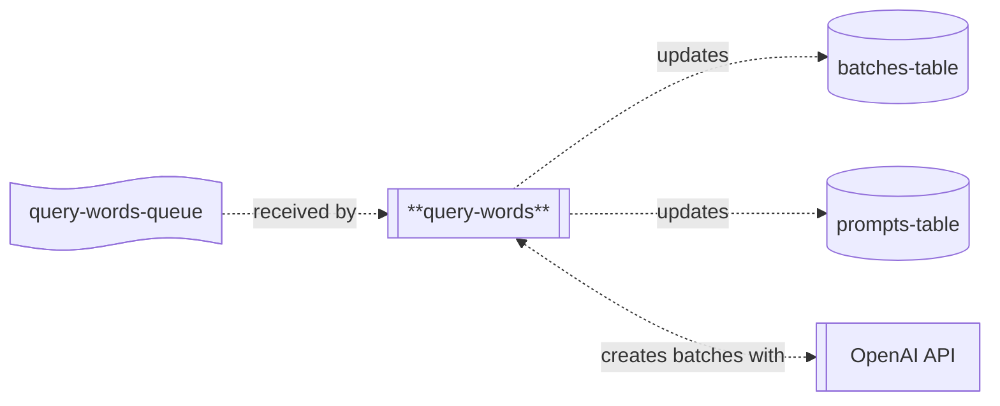

# query-words

## Description

This repo contains the source code for the `query-words` lambda, which is part of the Word List application's backend processing chain for updating word scores.



The `query-words` lambda receives a batch of messages containing information about words to be queried.  Using this information, it builds a batch request file and uploads this to OpenAI, creating a batch proccesing request.  Information about the batches and prompts is stored in their respective tables; this allows words to be re-requested if they are missed out which sometimes happens.

This lambda contains the prompt used to generate the word scores.

## Environment Variables

The lambda uses the following environment variables:

| Variable Name      | Description                                        |
|--------------------|----------------------------------------------------|
| BATCHES_TABLE_NAME | Name of the table batch information is stored in.  |
| PROMPTS_TABLE_NAME | Name of the table prompt information is stored in. |
| OPENAI_MODEL_NAME  | Name of the OpenAI model being used.               |

## Common Packages

This project uses the `WordList.Common` shared library (in the `lib-common` repository) which is published on GitHub.  To be able to import it, you'll need to use the following command:

```
dotnet nuget add source --username <your-username> --password <github-PAT> --store-password-in-clear-text --name github "https://nuget.pkg.github.com/word-list/index.json"
```